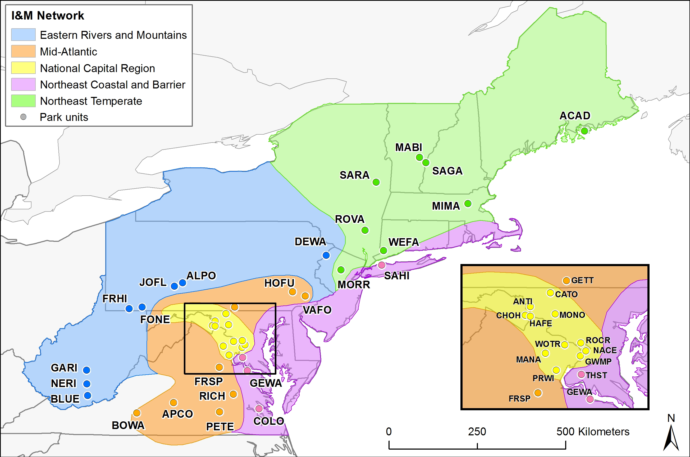

```{r setup, include=FALSE}
knitr::opts_chunk$set(echo = FALSE)
```


```{r imports, include = FALSE, results = 'hide'}
library(tidyverse)
library(forestTrends)
library(png)
library(knitr)
library(cowplot)
library(magick)

dens_df <- read.csv("../data/EFWG_full_dataset_20211101.csv")
park_info <- read.csv("../data/park_names.csv") %>% 
  filter(park_full == park_name)
park_data <- read.csv("../results/20220325/final_park_results.csv") %>% 
  filter(park == paste(park_info$park)) %>% 
  filter(labels == "Seedling Density" & metgrp == "Regen. Status") %>% 
  mutate(park_reggrp = ifelse(park_reggrp == "Sec.", "Secure", park_reggrp))
```


### Introduction

Forests cover tens of thousands of acres in eastern national parks, providing habitat for countless plants, animals, fungi, and insects. Park forests protect water quality and soil stability, as well as influence our local weather and reduce some gases that contribute to climate change. However, these critical park resources face a range of threats.
 
Forest health monitoring data indicate significant threats to future sustainability of park forests. Many parks lack the minimum level of seedling and sapling density needed to replace canopy trees as they die, whether from age, natural disturbance, or the effects of non-native pests and pathogens. When forests lack sufficient regeneration, or the species composition in the regeneration layer does not match the canopy, we call this a regeneration debt.

```{r figSvg, fig.cap = "Figure 2. Trends in tree, sapling and seedling abundance by species group.", fig.align = "center", dpi = 600, out.width = "7.5in"}
fig_svg <- cowplot::ggdraw() + cowplot::draw_image(paste0("../results/20220325/park_plots/total/", park_info$park, "_Total_metrics.svg"))

plot(fig_svg)
```

### Park Summary
`r paste(park_info$park_full)` (`r paste(park_info$park)`) is located in the `r ifelse(park_info$Network == "NETN", paste("Northeast Temperate"), ifelse(park_info$Network == "NCRN", paste("National Capital Region"), ifelse(park_info$Network == "NCBN", paste("Northeast Coastal and Barrier"), ifelse(park_info$Network == "MIDN", paste("Mid-Atlantic"), paste("Eastern Rivers and Mountains")))))` `r paste0( '(', park_info$Network, ')')` Inventory and Monitoring Network (Figure 1). This park's regeneration status is categorized as `r paste(park_data$park_reggrp)`.


```{r fig.cap = "Figure 1. Map of parks included in regional regeneration project.", out.width='100%', fig.align = "center", dpi = 600}

```


### Source Publication
XXX


